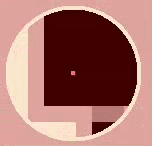
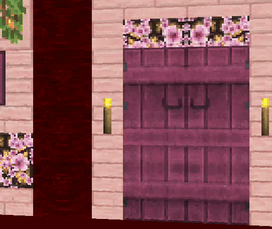

🇫🇷 Version française disponible [ici](README_FR.md)
* * *
# Project presentation - `cub3D`

**Introduction**

*This project was realized in a **duo with [Naphiye](https://github.com/Naphiye)***

## **Description**
This project is a **3D graphical project** inspired by the classic game *Wolfenstein 3D*.  
The objective is to create a **first-person 3D maze renderer** using **raycasting**, allowing the player to navigate through a map rendered in real time.

This project introduces fundamental concepts of **computer graphics**, **geometry**, and **event handling**, using the **MiniLibX** graphical library.

This project involves :
- Implementing a raycasting engine from scratch
- Rendering a 3D environment from a 2D map
- Handling player movement and camera rotation
- Managing textures, colors, and collision detection
- Parsing and validating configuration files
- Creating a smooth and responsive graphical experience


* * *

## Languages & Technologies

**Language**
- C (C99 standard)

**Technologies**
- Makefile
- MiniLibX
- Raycasting algorithms
- Trigonometry
- Event handling
- Dynamic memory management

* * *
##  Game Rules

The executable `cub3D` will receive a map as the only argument, and this map will have a `.cub` filetype.

### Player movement

|  Key  |          Action          |
|:-----:|:------------------------:|
|   W   |       Move forward       |
|   S   |      Move backward       |
|   A   |        Move left         |
|   D   |        Move right        |
| ← / → |      Rotate camera       |
|  ESC  |     Exit the program     |
|   E   | Open/close doors (bonus) |


### Gameplay
`cub3D` is not a traditional game with win or loss conditions. Its purpose is to demonstrate a **real-time 3D rendering engine** and allow the player to freely explore a maze from a first-person perspective.

The player can move around the environment, observe wall textures, interact with doors (bonus), and experience smooth camera rotation and collision handling.

You can close `cub3D` by clicking on the red cross on the window’s frame, or pressing `Esc`.

### Map rules
The file also must follow these rules :
- Paths to wall textures (NO, SO, WE, EA)
- Floor and ceiling colors
- A map layout (*closed/surrounded by walls*)
- Player starting position and orientation

Only the following characters are allowed :
- **N**, **W**, **S**, **E** *(player with his orientation)*
- **1** *(wall)*
- **0** *(empty space)*
- **D** *(door - **bonus** only)*

*Example :*
```
NO ./textures/wall_north.xpm
SO ./textures/wall_south.xpm
WE ./textures/wall_west.xpm
EA ./textures/wall_east.xpm

F 220,100,0
C 225,30,0

111111
100001
101101
1000N1
111111
```


* * *
## Bonus
The bonus version includes :
- Wall collision
- Minimap
- Animated sprites
- Doors which can be opened and closed

The executable is named `./cub3D_bonus`





* * *

## Assets & Credits
- Sprites were taken from a **[Minecraft resource pack](https://www.minecraft-france.fr/resources-pack/textures-256x256/)**.
- All image editing, composition, and montage were done by **us**

*This project is strictly for educational and non-commercial purposes.*

* * *
# Using `cub3D`
## Makefile rules
1. **all** as *default rule*: builds the project, compiles all `.c` files into `.o`, then **creates**  the program (`cub3D`)
2. **clean** : removes compiled object files (`.o`)
3. **fclean** : *clean* rule and removes the executable (`cub3D`)
4. **re** : *fclean* then *all* rule
5. **bonus** : builds the project with bonus features enabled
6. **rebonus** : *fclean* then *bonus* rule

* * *

## How to use `cub3D`

*Note : the `cub3D` project works on its own and uses the [libft](https://github.com/bibickette/libft) and [minilibx-linux](https://github.com/42Paris/minilibx-linux) libraries. Since they are included as submodules, the repository must be cloned with them.*
1. Clone `cub3D` in a folder first  : `git clone --recurse-submodules https://github.com:bibickette/cub3D.git`
2. Go to the `cub3D` folder then compile it : `cd cub3D && make`
3. Run the game with a map file : `./cub3D maps/tuto_map.cub`. *The folder `maps/` contains maps that can be used*

You can now test my `cub3D` game !

* * *
*Project validation date : January 30, 2025*